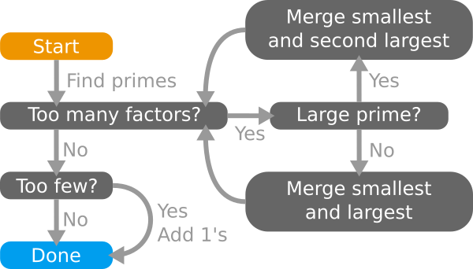

# Tessallate.py

## Basic Outline:

The purpose of this program is to essentially determine the dimensions of a
given volume. This sounds quite simple at first, the caviot is that the value
of each axis dimension needs to be as close to an even distribution as
possible. This esentially means that when we visualise it as a three
dimensional shape.we're doing our best to make a cube.

First, the tail factors of the original number are calculated and collected
in a list. This list is pre-sorted from least to greatest which will be
helpful in the next phase when we try to intellegently combine items until
only 2-3 remain (Or however many are specified).

The solution that I have arrived at looks something like the following
pseudocode. 

```Pseudo
While (Factor_List is too long):
    Case 1: One too many items
        Merge first two items
        DONE
    
    Case 2: List contains a large item
        Merge first and second largest items
        LOOP

    Case 3: List is roughly even distribution
        Merge first and last item
        LOOP


# else Factor_List is not too long
if (Factor_List is too short):
    append 1's as necessary
    DONE

if (Factor_List length is correct)
    DONE
```
-------------------------------------------------------------------------------

## Flowchart Representation:




-------------------------------------------------------------------------------
Last Updated - 11/9/2020
